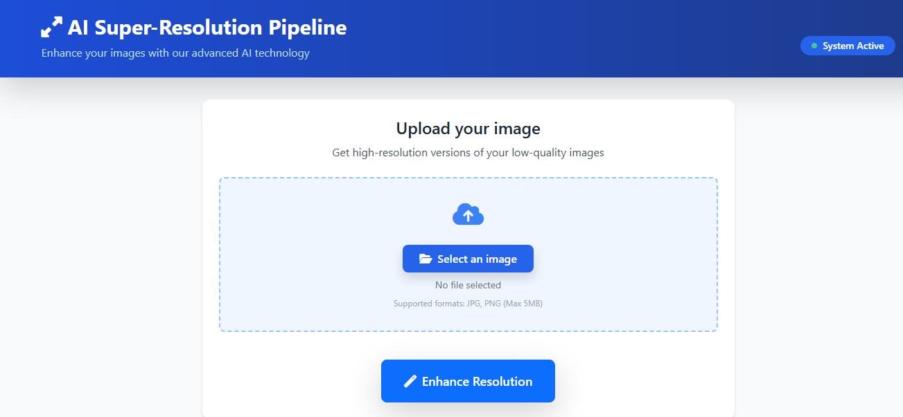
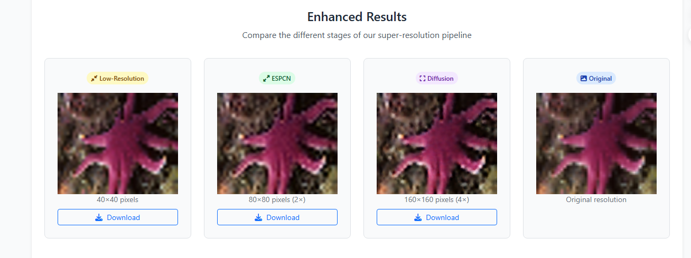
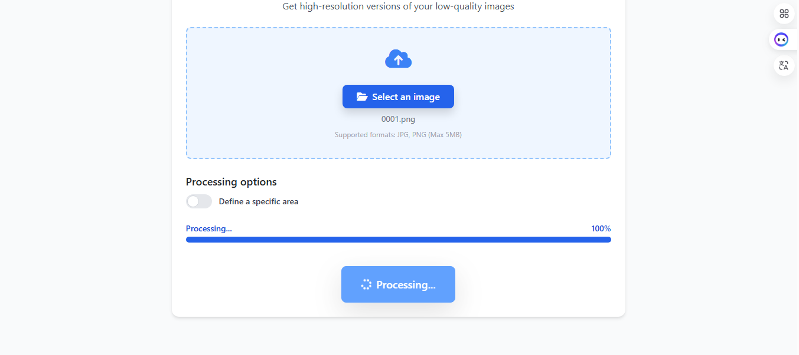
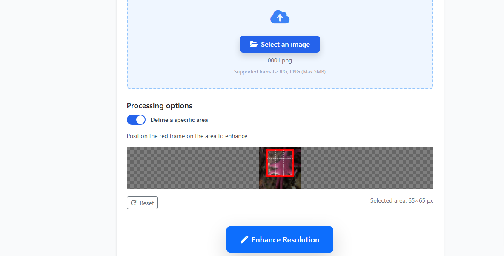
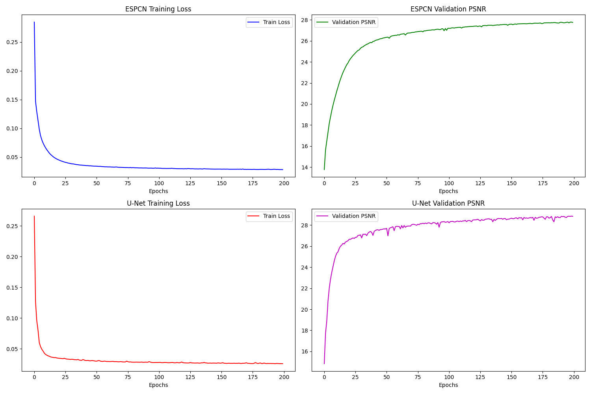
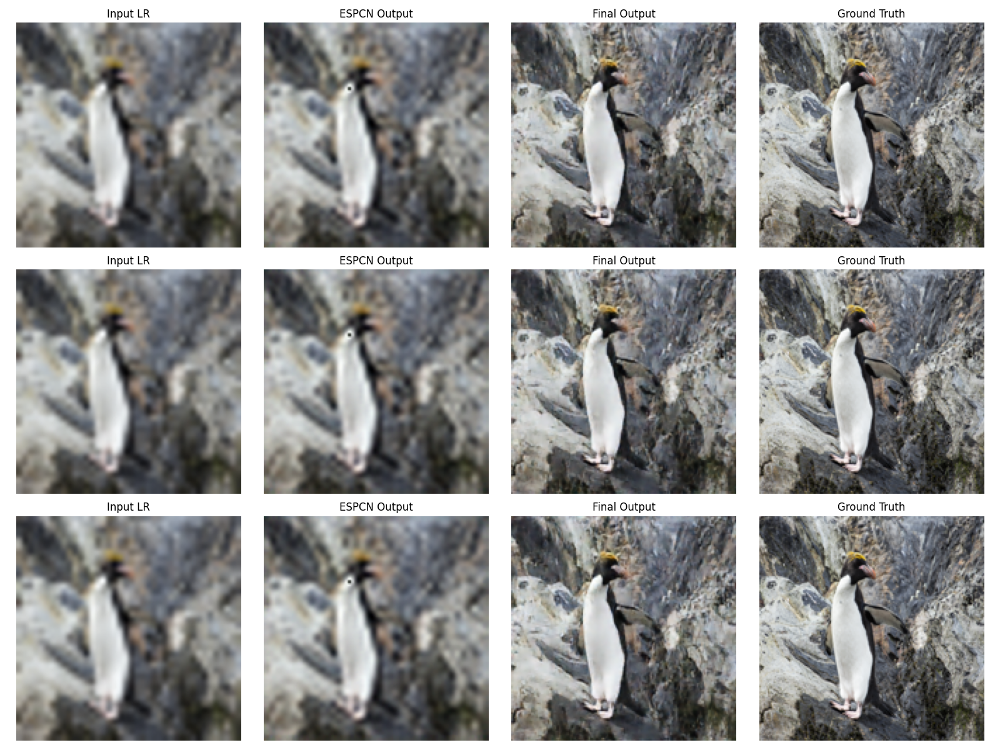

# 🧠 AI-Powered Image Enhancement Web App

A modern web-based application that uses deep learning to enhance and upscale images. Built with **Flask** and powered by **PyTorch**, this tool integrates advanced models like **ESPCN** and **Conditional U-Net** for super-resolution and denoising. The app features smart cropping, zoom synchronization, and real-time image comparison.

> 📖 **License**: This project is licensed under the [MIT License](#-license).

---

## 💡 Overview

This system enhances image quality through a two-step deep learning pipeline:

- 📈 **ESPCN**: Efficiently upscales low-resolution input (40×40) to intermediate resolution (80×80).
- 🧼 **Conditional U-Net**: Enhances and denoises the output further to high resolution (160×160).

The web interface provides:

- 📁 Image upload & preview
- ✂️ Interactive cropping via **Cropper.js**
- 🔍 Unified zoom and pan across all image outputs
- 🎚️ Interactive comparison slider (original vs enhanced)
- ⏳ Smooth progress simulation for better UX

---

## 🧪 Model Summary

| Model              | Role                    | Output Size |
|-------------------|-------------------------|-------------|
| ESPCN             | Upscaling (40×40 → 80×80) | 80×80       |
| Conditional U-Net | Denoising & Refinement    | 160×160     |

> ✅ Models are pre-trained and loaded from `.pth` files.

---

## 🌐 Web Interface

### 🖼 Image Upload + Crop  


### 🖼 Enhanced Results  


### 🔄 Processing  


### 🔬 Zoom & Comparison View  


### 📈 Training Curves  


### 🧠 Feature Visualization  


---

## 📊 Final Pipeline Evaluation

| Metric | Value    |
|--------|----------|
| PSNR   | 28.85 dB |
| SSIM   | 0.9261   |

---


## ▶️ How to Run

### 1. Clone the repository:

```bash
git clone https://github.com/HoussemBouagal/ImageEnhancementApp.git
cd ImageEnhancementApp
```

### 2. Create a virtual environment and install dependencies:

```bash
python -m venv venv
source venv/bin/activate  # On Windows: venv\Scripts\activate
pip install -r requirements.txt
```

### 3. Start the Flask app:

```bash
python app.py
```

---

## 📦 Requirements (requirements.txt)

```txt
flask
torch
torchvision
pillow
numpy
```

---

## 🗂️ Project Structure

```
ImageEnhancementApp/
│
├── trainlr/
│   ├── 0001.png
│   ├── 0002.png
│   └── 0003.png
│
├── static/
│   ├── increase.ico
│   └── assets/
│       ├── UI.jpg
│       ├── Enhanced Results.jpg
│       ├── Processing.jpg
│       ├── training_curves.jpg
│       ├── visualization.jpg
│       ├── Comparison.jpg
│       └── Zoom.jpg
│
├── templates/
│   └── index.html
│
├── models/
│   ├── espcn_final.pth
│   └── unet_final.pth
│
├── app.py
├── model_definitions.py
├── requirements.txt
└── README.md

```

---

## 📄 License

This project is licensed under the **MIT License**.

Read the full license in the [LICENSE](LICENSE) file.

---

## 👤 Author

**Houssem Bouagal**  
📧 Email: [mouhamedhoussem813@gmail.com](mailto:mouhamedhoussem813@gmail.com)  
🔗 LinkedIn: [Houssem Bouagal](https://www.linkedin.com/in/houssem-eddine-bouagal-98025a297)  
🌐 Portfolio: [houssembouagal.github.io/Portfolio/](https://houssembouagal.github.io/Portfolio/)
